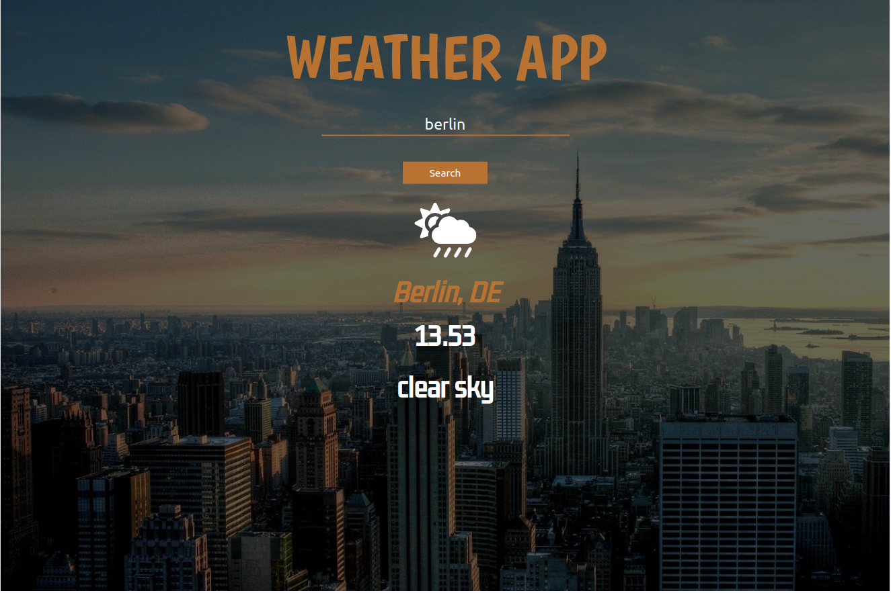

## Weather App

**[Test this app yourself](github.io)**

---

#### Navigation

- About Project
  - _Description_
  - _Developed With_
- Contact
  - E-Mail: 
  - GitHub: 
  - LinkedIn: 
- Used Tools
  - _Tailwind_
  - _Fonts_
  - _Design_
  - _Icons_

---

### About Project

You can learn the weather information of any province you want in degrees.

##### Developed With

- [x] _HTML_
- [x] _CSS_
- [x] _JavaScript_
- [x] _React_
- [x] _Tailwind_
- [x] _npm_

---

### Contact

Mail: mehmetgokce61@gmail.com 
GitHub: https://github.com/Mehmet-Gkc 
LinkedIn: https://www.linkedin.com/in/mehmet-g%C3%B6kce-63ba9a254/(#)

---

### Used Tools

- [icons](https://react-icons.github.io/react-icons/icons?name=fa)
- [tailwind](https://tailwindcss.com/docs/guides/create-react-app)
- [npm](https://www.npmjs.com/)
- [Google Fonts](https://fonts.google.com/)
- [Visual Studio Code](https://code.visualstudio.com/)

---

Made with Mehmet Gökce
